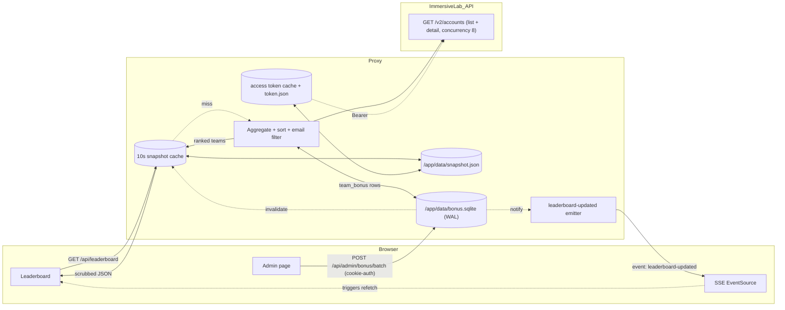
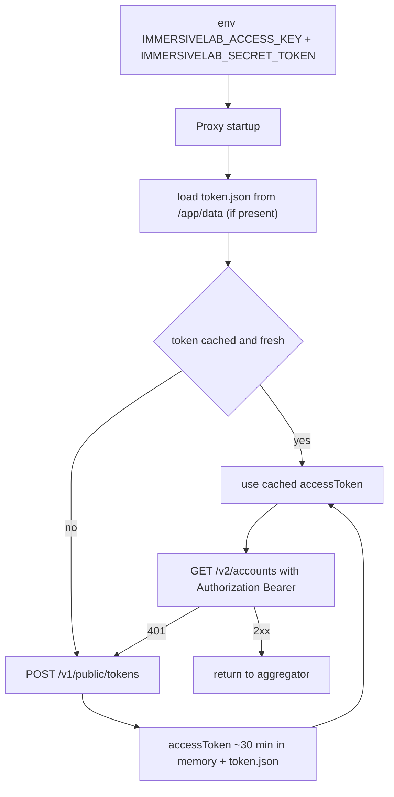

# Data Flow: Account Points → Public Dashboard

Site is public. Browser never sees an ImmersiveLab token. A backend (Fastify) proxy holds the secret, exchanges for an access token, walks `/v2/accounts`, filters participants by `@immersivelabs.pro` email, aggregates a per-team leaderboard (1 Immersive Labs account per team), and returns a scrubbed snapshot. The browser also keeps an SSE connection open to `/api/leaderboard/stream` for instant pushes after admin bonus writes.

> **Note:** teams receive fresh Immersive Labs accounts at `EVENT_START_AT`, so `Account.points` is event-scoped by construction. No `/v2/attempts` walk, no `completedAt` filtering. See [implementation/aggregation.md](implementation/aggregation.md) and [implementation/dashboard-storage-plan.md](implementation/dashboard-storage-plan.md).
>
> **Admin bonus layer (three categories):** on top of `Account.points`, an authenticated admin page awards per-team bonus points across **three fixed categories** — `mario_points`, `crokinole_points`, `helping_points`. Bonuses live in a separate SQLite file (`bonus.sqlite`). Merge rule: `il_points = Account.points + helping_points` (helping is hidden from the public as a separate line); `total = il_points + mario_points + crokinole_points`. Admin writes push via SSE so the public dashboard updates within ~100 ms. See [implementation/admin-bonus-plan.md](implementation/admin-bonus-plan.md).

## Sequence

```mermaid
sequenceDiagram
    participant U as Public viewer
    participant FE as React app
    participant PX as Proxy (/api)
    participant DB as bonus.sqlite
    participant ImmersiveLab as api.immersivelabs.online
    participant A as Admin

    U->>FE: open site (no login)
    FE->>PX: GET /api/leaderboard/stream (SSE subscribe)
    PX-->>FE: event: leaderboard-updated (initial snapshot)
    loop every 30s (pauses if document.hidden; fallback when SSE drops)
        FE->>PX: GET /api/leaderboard
        alt phase == ended
            PX-->>FE: frozen last snapshot (no upstream call)
        else cached <10s
            PX-->>FE: cached snapshot
        else stale
            PX->>PX: ensure access token (refresh if expired)
            alt token missing or expired
                PX->>ImmersiveLab: POST /v1/public/tokens (access_key + secret)
                ImmersiveLab-->>PX: accessToken ~30 min
            end
            PX->>ImmersiveLab: GET /v2/accounts?page_token=...
            ImmersiveLab-->>PX: page + nextPageToken
            Note over PX,ImmersiveLab: paginated list, then per-uuid detail fetch (concurrency 8)
            PX->>PX: filter accounts by @immersivelabs.pro email
            PX->>DB: INSERT OR IGNORE team_bonus row per team
            DB-->>PX: mario/crokinole/helping + active
            PX->>PX: merge il_points = Account.points + helping; total = il + mario + crokinole
            PX->>PX: drop teams where active=0
            PX->>PX: sort desc by total, tie-break by lastActivityAt, then displayName
            PX->>PX: scrub PII (drop email)
            PX->>PX: cache snapshot (memory + /app/data/snapshot.json)
            PX-->>FE: { teams[], phase, eventWindow, updatedAt }
        end
        FE->>U: render Leaderboard
        alt ImmersiveLab returns 401
            PX->>ImmersiveLab: POST /v1/public/tokens (refresh)
            PX->>ImmersiveLab: retry request
        end
    end

    Note over A,PX: Admin flow — cookie-auth
    A->>PX: POST /api/admin/bonus/batch (category deltas)
    PX->>DB: transactional UPDATE per category
    DB-->>PX: updated rows
    PX->>PX: invalidate snapshot cache
    PX-->>FE: SSE event: leaderboard-updated (on next /api/leaderboard)
    FE->>PX: GET /api/leaderboard (triggered by SSE)
    PX-->>FE: fresh snapshot (~100 ms end-to-end)
```

## Data shape



## Auth bootstrap (server-side only)



## Aggregation rules
- `Account.points: null` → treat as `0`.
- Leaderboard merge uses three bonus categories stored in `team_bonus` (`mario_points`, `crokinole_points`, `helping_points`, all defaulting to 0):
  - `il_points` on the public wire = `Account.points + helping_points` (helping merged in, not shown as a separate column to spectators).
  - `total = il_points + mario_points + crokinole_points`.
  Fresh accounts = event-scoped by construction; no `completedAt` filtering needed.
- Teams with `team_bonus.active = 0` are excluded from the payload (hidden / DQ).
- **Event window** (`EVENT_START_AT` / `EVENT_END_AT`) drives **phase + freeze**, not scoring:
  - `now < EVENT_START_AT` → `phase = "pre"`, `teams: []` (protects against cred leaks before start).
  - `in-window` → `phase = "live"`, normal aggregation.
  - `now > EVENT_END_AT` → `phase = "ended"`, freeze: stop rebuilds, keep serving last pre-end snapshot.
- Sort teams desc by `total`. Tie-break: `lastActivityAt` asc (earlier finisher wins), then `displayName` asc.
- Snapshot cached for ~10 s (`SNAPSHOT_TTL_MS`) in memory, persisted to `/app/data/snapshot.json` on every successful rebuild (atomic tmp + rename). Loaded on boot so restart serves stale instantly.
- Admin bonus writes invalidate the snapshot cache and emit a `leaderboard-updated` SSE event; public clients refetch within ~100 ms instead of waiting for the 30 s poll.

## Endpoints
**Proxy → browser (public, read-only)**
- `GET /api/leaderboard` — ranked team snapshot `{ teams: [{ il_points, mario_points, crokinole_points, total, ... }], phase, eventWindow, updatedAt }`. `il_points` already includes helping.
- `GET /api/leaderboard/stream` — SSE, emits `leaderboard-updated` on cache invalidation.
- `GET /api/health` — proxy + token status + `eventWindow`.

**Proxy → browser (admin, cookie-auth)**
- `POST /api/admin/login` / `/logout`; `GET /api/admin/bonus`; `POST /api/admin/bonus/batch`; `PATCH /api/admin/bonus/:teamId/active`; `GET /api/admin/export.csv`. See [implementation/admin-bonus-plan.md](implementation/admin-bonus-plan.md).

**Proxy → ImmersiveLab (server-side, authenticated)**
- `POST /v1/public/tokens` — token exchange.
- `GET /v2/accounts` — paginated.
- Not used: `/v2/activities`, `/v2/attempts`, `/v2/teams`, `/v2/teams/{id}/memberships`, deprecated `Account.teams`.

## Security invariants
- No ImmersiveLab credentials or tokens in the JS bundle, HTML, or any response the browser receives.
- No passthrough endpoint that forwards arbitrary ImmersiveLab paths.
- Responses scrubbed: drop PII fields not needed by the UI (keep `displayName`; drop `email`).
