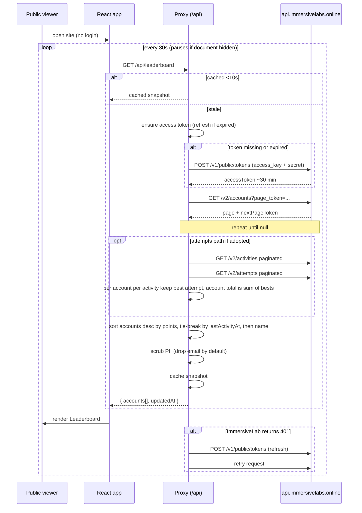
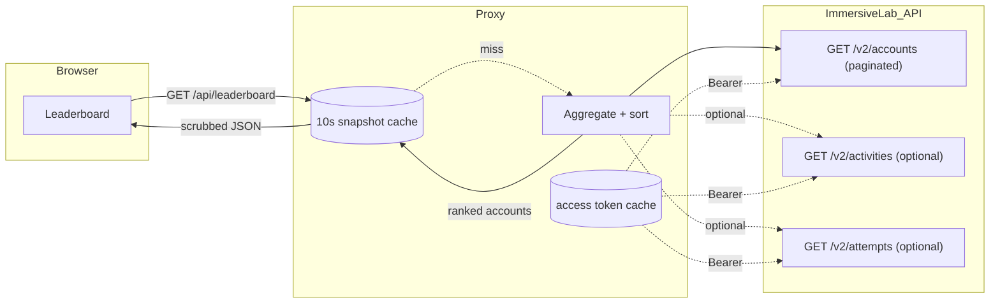
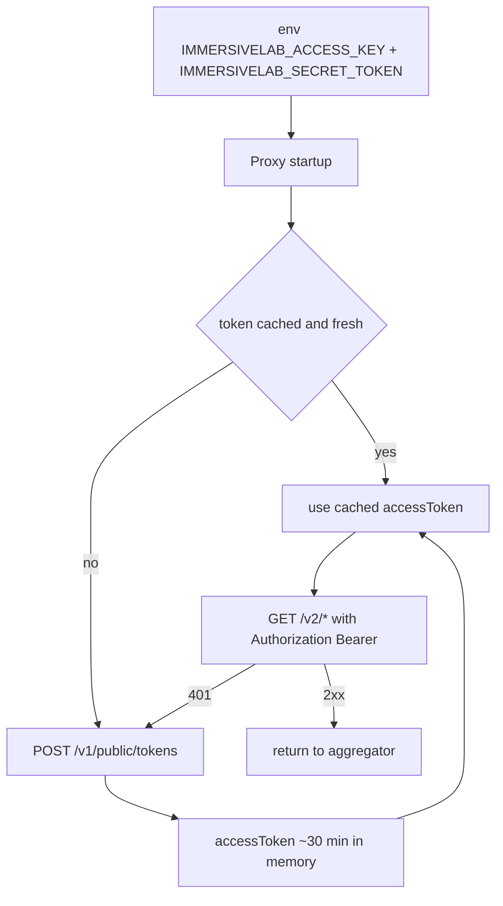

# Data Flow: Account Points → Public Dashboard

Site is public. Browser never sees an ImmersiveLab token. A backend proxy holds the secret, exchanges for an access token, walks the ImmersiveLab API, aggregates a per-account leaderboard, and returns a scrubbed snapshot.

> **Note:** a prior per-account dashboard (`devops-day-leaderboard`) already implements the auth + ImmersiveLab-client + sync layers and persists to SQLite with cron-driven sync (attempts every 1–2 min, full sync nightly). We reuse those layers here. Points can be read from `Account.points` (cheap, one walk) or recomputed from `attempts` (prior-project path, enables time-spent + per-activity detail). Choice tracked in [../TODO.md](../TODO.md).

## Sequence

## Data shape

## Auth bootstrap (server-side only)

## Aggregation rules
- `Account.points: null` → treat as `0`.
- **Event window** is defined by `EVENT_START_AT` / `EVENT_END_AT` env vars (ISO 8601). The API has no `Event` entity; these bounds are supplied out-of-band.
- Leaderboard total = `Account.points` (v1 minimal, **not window-scoped** — `Account.points` is cumulative lifetime) **or**, on the attempts path: for each activity the account has tackled, filter attempts to those with `completedAt` in `[EVENT_START_AT, EVENT_END_AT]`, take the **best** (highest-scoring) remaining attempt, then sum those per account. Retries do not stack. Out-of-window attempts never contribute.
- Phase: `now < EVENT_START_AT` → `"pre"` (empty accounts); `in-window` → `"live"`; `now > EVENT_END_AT` → `"ended"` (frozen).
- Sort accounts desc by total. Tie-break: `lastActivityAt` asc (earlier finisher wins), then display name.
- Attempts path only: `totalDuration` read with `??` (not `||`) — `0 s` is valid. Orphan attempts (activity 404) are skipped, not fatal.
- Snapshot cached for ~10 s to protect ImmersiveLab rate limits regardless of viewer count.

## Endpoints
**Proxy → browser (public, read-only)**
- `GET /api/leaderboard` — ranked account snapshot `{ accounts: [...], updatedAt }`.
- `GET /api/health` — proxy + token status.

**Proxy → ImmersiveLab (server-side, authenticated)**
- `POST /v1/public/tokens` — token exchange.
- `GET /v2/accounts` — paginated.
- `GET /v2/activities` — paginated (attempts path only).
- `GET /v2/attempts` — paginated (attempts path only).
- Not used: `/v2/teams`, `/v2/teams/{id}/memberships`, deprecated `Account.teams`.

## Security invariants
- No ImmersiveLab credentials or tokens in the JS bundle, HTML, or any response the browser receives.
- No passthrough endpoint that forwards arbitrary ImmersiveLab paths.
- Responses scrubbed: drop PII fields not needed by the UI (keep `displayName`; drop `email` by default).
