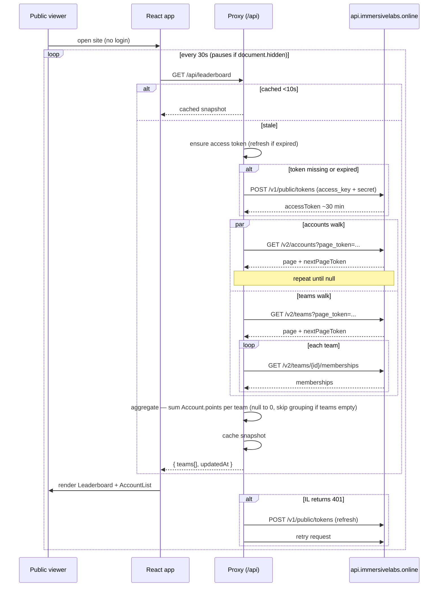
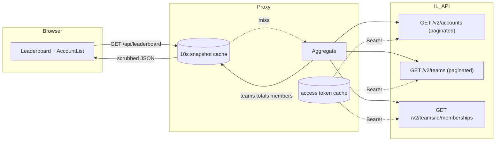
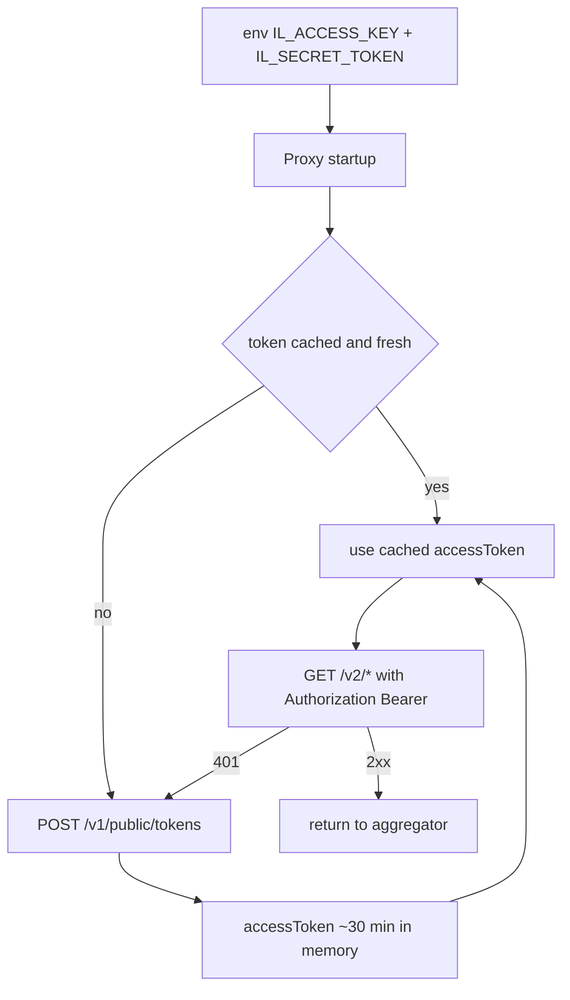

# Data Flow: Account Points → Public Dashboard

Site is public. Browser never sees an IL token. A backend proxy holds the secret, exchanges for an access token, walks the IL API, aggregates, and returns a scrubbed leaderboard.

## Sequence

## Data shape

## Auth bootstrap (server-side only)

## Aggregation rules
- `Account.points: null` → treat as `0`.
- Team total = sum of member `Account.points`.
- If IL `/v2/teams` returns empty → no team grouping; `teams: []` in payload.
- Sort teams desc by total; tie-break by member count then name.
- Snapshot cached for ~10 s to protect IL rate limits regardless of viewer count.

## Endpoints
**Proxy → browser (public, read-only)**
- `GET /api/leaderboard` — aggregated snapshot.
- `GET /api/accounts` *(optional)* — scrubbed account list for drill-down.
- `GET /api/health` — proxy + token status.

**Proxy → IL (server-side, authenticated)**
- `POST /v1/public/tokens` — token exchange.
- `GET /v2/accounts` — paginated.
- `GET /v2/teams` — paginated.
- `GET /v2/teams/{team_id}/memberships`.
- Not used: `GET /v2/accounts/{id}/teams` (redundant), deprecated `Account.teams`.

## Security invariants
- No IL credentials or tokens in the JS bundle, HTML, or any response the browser receives.
- No passthrough endpoint that forwards arbitrary IL paths.
- Responses scrubbed: drop PII fields not needed by the UI (e.g. keep `displayName` + `points`; consider dropping `email` unless the drill-down shows it).
