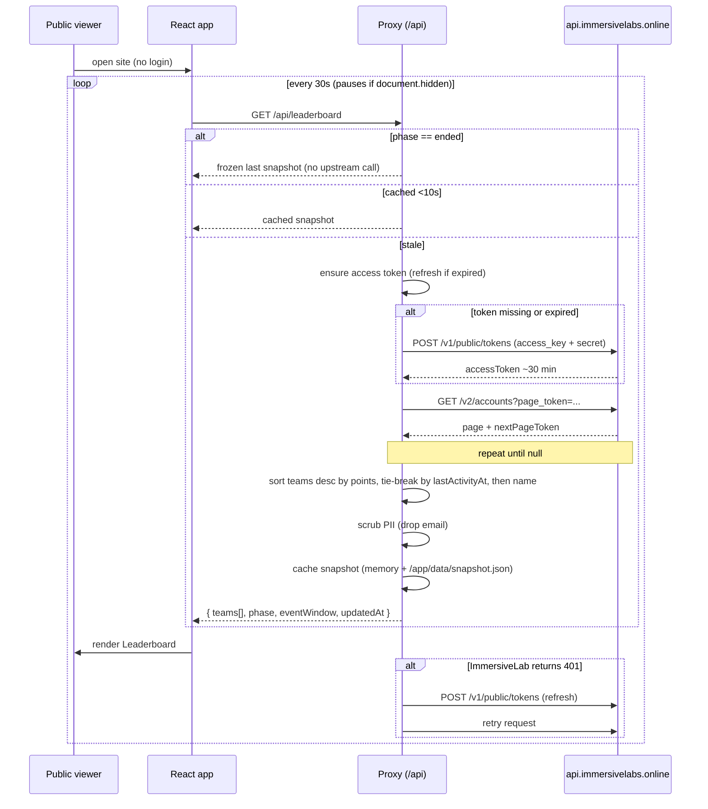
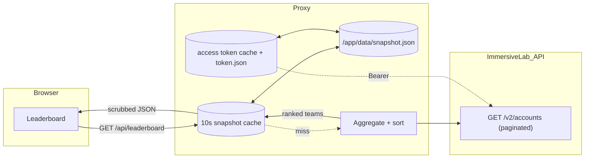
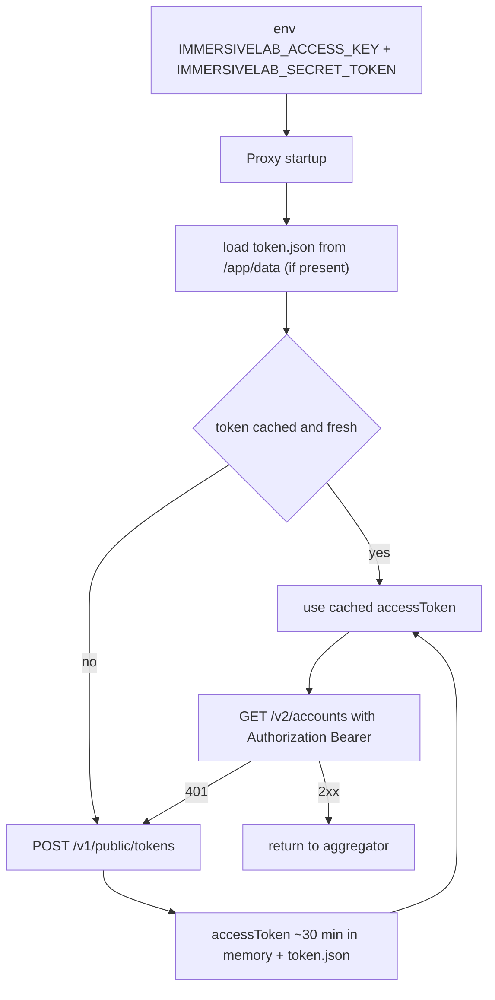

# Data Flow: Account Points → Public Dashboard

Site is public. Browser never sees an ImmersiveLab token. A backend proxy holds the secret, exchanges for an access token, walks `/v2/accounts`, aggregates a per-team leaderboard (1 Immersive Labs account per team), and returns a scrubbed snapshot.

> **Note:** teams receive fresh Immersive Labs accounts at `EVENT_START_AT`, so `Account.points` is event-scoped by construction. No `/v2/attempts` walk, no `completedAt` filtering. See [implementation/aggregation.md](implementation/aggregation.md) and [implementation/dashboard-storage-plan.md](implementation/dashboard-storage-plan.md).

## Sequence

## Data shape

## Auth bootstrap (server-side only)

## Aggregation rules
- `Account.points: null` → treat as `0`.
- Leaderboard total = `Account.points` directly. Fresh accounts = event-scoped by construction; no `completedAt` filtering needed.
- **Event window** (`EVENT_START_AT` / `EVENT_END_AT`) drives **phase + freeze**, not scoring:
  - `now < EVENT_START_AT` → `phase = "pre"`, `teams: []` (protects against cred leaks before start).
  - `in-window` → `phase = "live"`, normal aggregation.
  - `now > EVENT_END_AT` → `phase = "ended"`, freeze: stop rebuilds, keep serving last pre-end snapshot.
- Sort teams desc by `points`. Tie-break: `lastActivityAt` asc (earlier finisher wins), then `displayName` asc.
- Snapshot cached for ~10 s (`SNAPSHOT_TTL_MS`) in memory, persisted to `/app/data/snapshot.json` on every successful rebuild (atomic tmp + rename). Loaded on boot so restart serves stale instantly.

## Endpoints
**Proxy → browser (public, read-only)**
- `GET /api/leaderboard` — ranked team snapshot `{ teams: [...], phase, eventWindow, updatedAt }`.
- `GET /api/health` — proxy + token status + `eventWindow`.

**Proxy → ImmersiveLab (server-side, authenticated)**
- `POST /v1/public/tokens` — token exchange.
- `GET /v2/accounts` — paginated.
- Not used: `/v2/activities`, `/v2/attempts`, `/v2/teams`, `/v2/teams/{id}/memberships`, deprecated `Account.teams`.

## Security invariants
- No ImmersiveLab credentials or tokens in the JS bundle, HTML, or any response the browser receives.
- No passthrough endpoint that forwards arbitrary ImmersiveLab paths.
- Responses scrubbed: drop PII fields not needed by the UI (keep `displayName`; drop `email`).
